# 🍧 IceCream
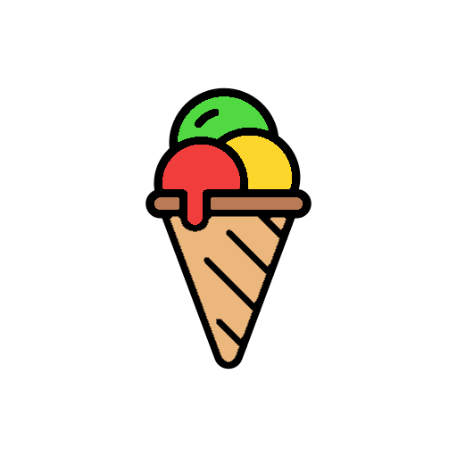

### 자녀들의 안전한 보행을 위한 교통안전 앱

##### 기획 의도
  - 스쿨존 내 교통사고 예방
  - 사용자(아이들)의 횡단보도 사용을 유도

##### 서비스 요약
  - 횡단보도 구역 내에 있을 경우, 과속 차량에 대한 알림 신호
  - 자녀의 위치를 부모가 알 수 있게 함
  - 자녀가 미리 설정해둔 영역에 도착 시 부모에게 알림 발송
  - 무단횡단 시 부모에게 알림 발송
  - 스마트폰과 워치를 연동하여 빠르고 쉽게 알림 확인 가능
 

## 🕞 프로젝트 진행 기간
**2024.04.08 ~ 2024.05.20** (6주)

 

## 💬 주요 기능
**1. 과속 차량에 대한 위험 알림**
    (1) 과속 차량 탐지 
   - 실시간으로 찍은 CCTV 영상을 GPU 서버로 보냄
   - GPU 서버에서 YOLOv9를 통해서, 차량 객체 감지와 차량의 속도를 파악
   - 과속 차량 발생 시 RabbitMQ로 과속이 발생한 cctv_name과 speed 데이터 전송 
   - 백엔드 서버에서 과속이 발생한 cctv_name과 speed 데이터 수집 
   - 어린이 보호 구역 제한 속도를 기준으로 위험 알림 메시지 생성
   - 기본 속도 30 이상 overspeed-1 / 35 이상 overspeed-2 / 45 이상 overspeed-3 파악 
   - cctv_name과 매핑된 횡단보도 조회 (cctv 근처에 위치한 횡단보도 조회) 
   - 과속 차량 인근 횡단보도 영역에 위치한 자녀에게 FCM을 통해 위험 알림 전송
    
   (2) 과속 위험 알림 대상자 판별
  - RabbitMQ의 GPS 데이터를 수집하여 보행자가 특정 횡단보도 영역에 위치하는지 판별
  - 특정 횡단보도에 위치하는 경우 Redis에 기록 

**2. 자녀 목적지 도착시, 부모 어플에 알림 전송**
   - 부모가 자녀의 앱 활성화 시간(=자녀 등하교 시간), 목적지 지정
   - 스케줄링을 통하여, 활성화 시간동안 자녀 휴대폰에서 RabbitMQ로 GPS 데이터 전송(1번/초)
   - 자녀 목적지 도착 시,  FCM를 통해 부모 어플로 자녀 도착 알림 메시지 전달
   - 부모는 자녀의 앱 활성화 시간동안 자녀의 실시간 위치 조회 가능

**3. 자녀 무단 횡단시, 부모 / 자녀에게 알림 전송**
   - 무단 횡단 영역을 PostgresSQL에 저장 (4326좌표계를 기준)
   - RabbitMQ의 GPS 데이터를 수집하여 자녀가 무단 횡단 영역에 위치하는지 파악
   - 자녀가 무단 횡단영역에 위치 하였을 때, FCM를 통해 부모 / 자녀에게 무단횡단 알림 발송

 

## 📱 서비스 화면
|                       앱 진입 화면                       |
| :------------------------------------------------------: |
|                                           |
| 부모 / 자녀를 선택해서  서비스를 이용할 수 있다 |

|       부모 회원가입       |        자녀 QR 생성         |      자녀 QR 등록      |
| :-------------------: | :---------------------------: | :------------------------: |
|    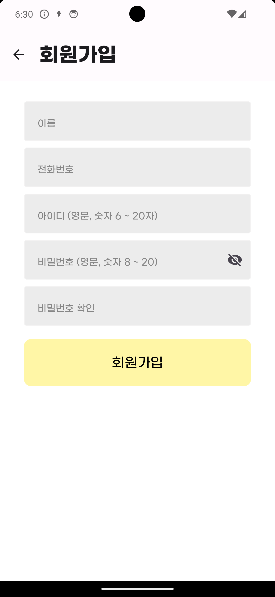     |        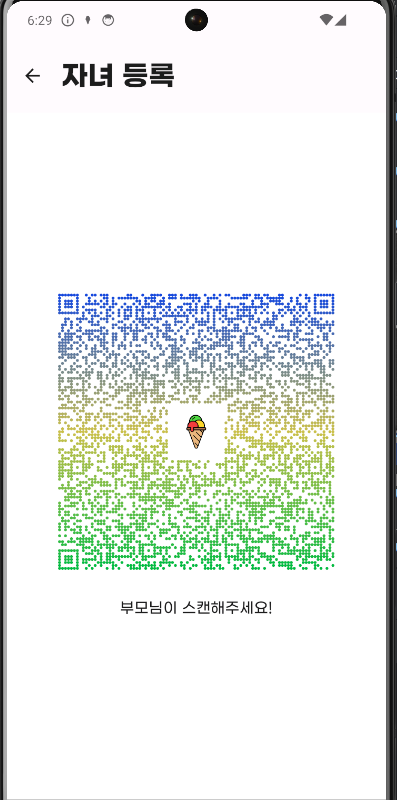         |      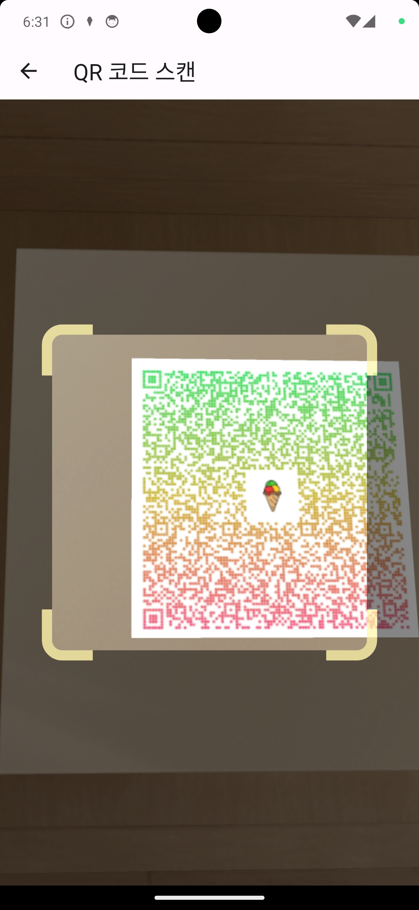        |
| 부모 회원가입 화면 | 자녀 등록을 위한 자녀 QR 생성 | 부모의 기기에서 자녀의 QR 등록으로 자녀 회원가입  |

※ 최초등록 이후 디바이스 ID를 통해 자동 로그인

|     부모 메인 화면      |      자녀 마커 클릭 시       |
| :---------------------: | :--------------------------: |
|     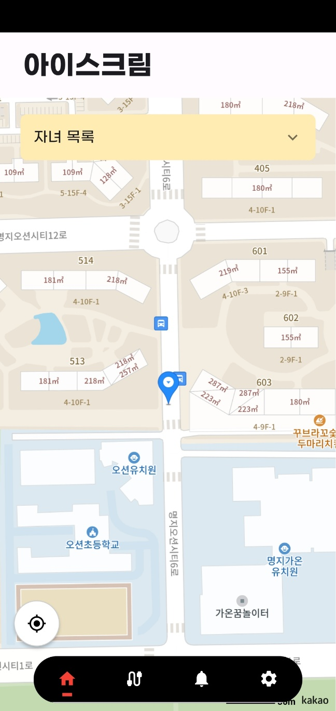      |       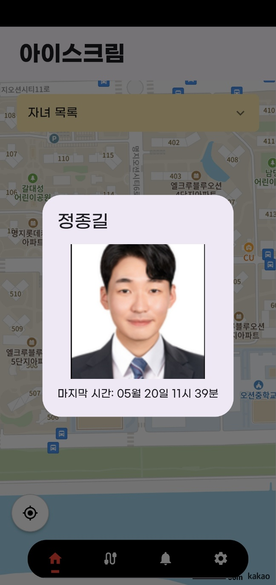         |
| 자신과 자녀의 위치 확인 | 자녀의 정보와 위치 확인 가능 |

|        안전 지킴이        |                     리워드 관리                      |
| :-----------------------: | :--------------------------------------------------: |
|      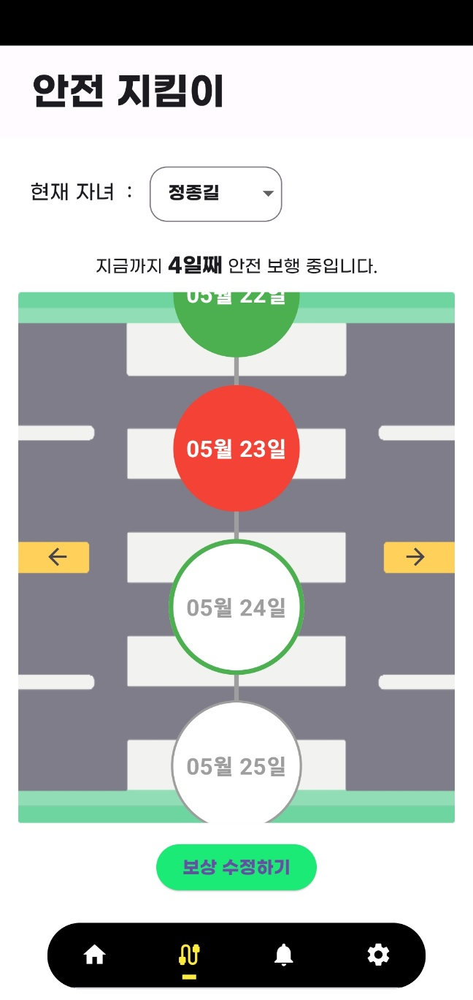       |                   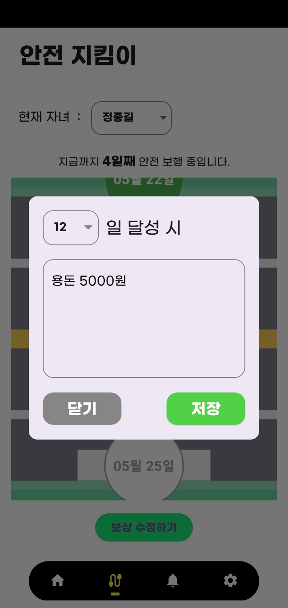                     |
| 자녀의 횡단보도 사용 확인 | 자녀의 횡단보도 사용에 대한   리워드 등록 및 수정 |

|    알림 내역 확인     |
| :-------------------: |
|    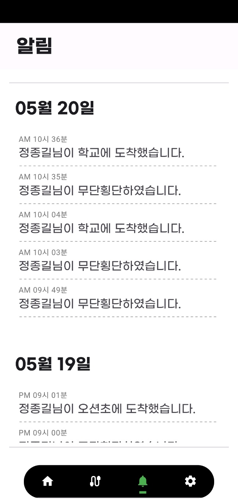     |
| 일자별 알림 내역 확인 |

|       자녀 목록       |        자녀 상세 정보         |      자녀 목적지 관리      |
| :-------------------: | :---------------------------: | :------------------------: |
|    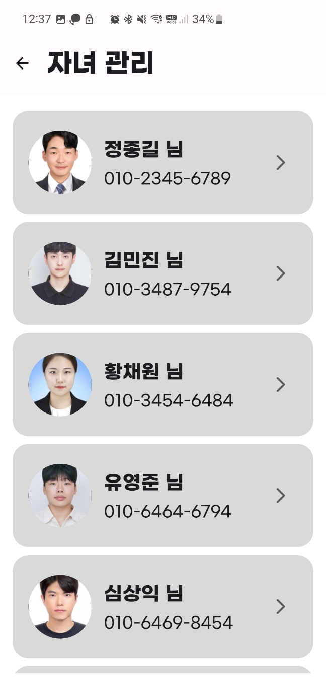     |                 |      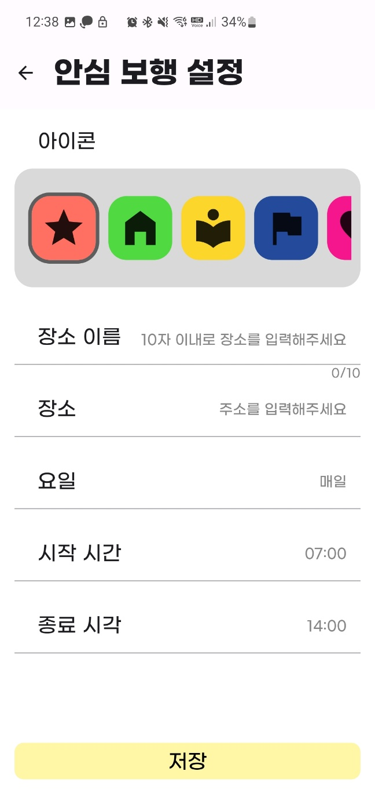        |
| 등록된 자녀 목록 확인 | 자녀의 상세 정보 조회 및 수정 | 자녀의 목적지 등록 및 수정 |

|    관리자 페이지     |
| :-------------------: |
|         |
| AI를 활용해 CCTV를 통한 차량의 속도 측정   과속 발생 시 사용자에게 위험 알림 전송  |

|                       과속 알림 화면                       |
| :------------------------------------------------------: |
|                     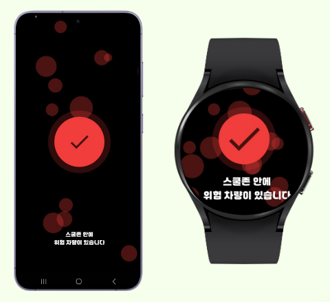                      |
| 과속 발생 시, 스마트폰 및 스마트워치에 위험 알림 전송 |

 
 

## 👩‍💻 개발 환경

|일정관리|형상관리|커뮤니케이션|디자인|
|:---:|:---:|:---:|:---:|
|  |  |  |  |

 

#### IDE

 

 

#### Frontend
  
   

 

#### Backend

  
    
    
  
   

 

#### AI 
     	 

#### DevOPS

    

 

## 🏢 ER Diagram
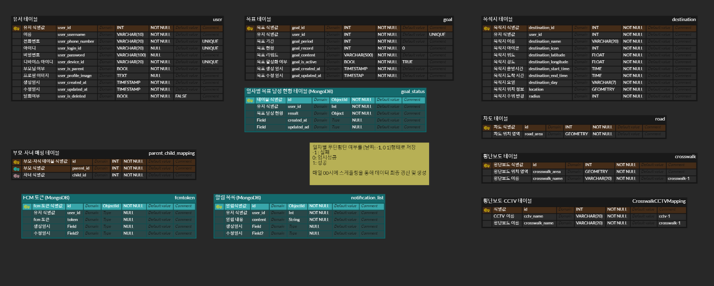

## 🏢 아키텍처

## 📑 프로젝트 산출물
- [아키텍처](./docs/icecream_architecture.png)
- [요구사항-기능 명세서](https://swamp-shaker-ff8.notion.site/39e2fa39bcd443a089e8906058a0056b?v=fa6777d377164e7dbbc40f70032615a7)
- [API 명세서](https://swamp-shaker-ff8.notion.site/API-1582f6714d75481c9570fe2654d21666)  
- [와이어프레임](https://www.figma.com/design/YQuvNP8ix8z96yOsAmGpBU/%EC%95%84%EC%9D%B4%EC%8A%A4%ED%81%AC%EB%A6%BC?node-id=67-690&t=xTt8Ec62LzmAH2Q3-1)
- [포팅메뉴얼](./exec/PortingManual.md)
- [UCC](./docs/UCC.mp4)
- [시연영상](./docs/시연영상.mp4)

## 👨‍👨‍👧👨‍👨‍👧 팀원
|BE|BE|BE|FE|FE|FE|AI|
|:---:|:---:|:---:|:---:|:---:|:---:|:---:|
|**이재진**|**정종길**|**심상익**|**유영준**|**황채원**|**서준하**|**김민진**|
|  |  |  |  |  |  |  |
| 팀장   BackEnd   Infra   GPU서버| BankEnd   Security   MQ 구축   | BackEnd   ELK 스택   관리자page   GPU서버 | FrontEnd   FCM   Design | Frontend   WebSocket   CCTV구축 | FrontEnd   GPS   | Yolo   객체 추적   객체 속도   |
